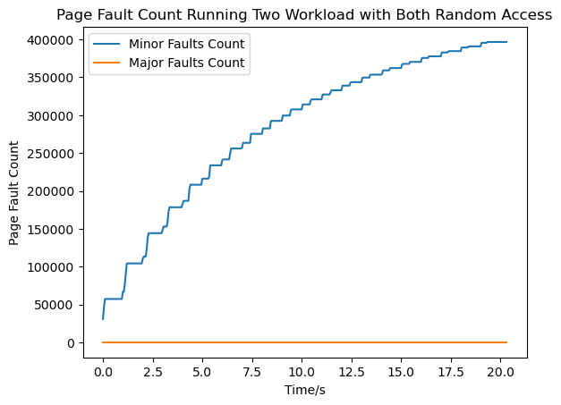
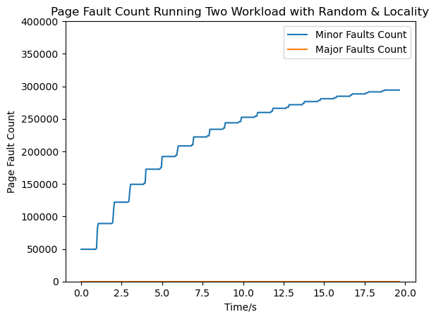
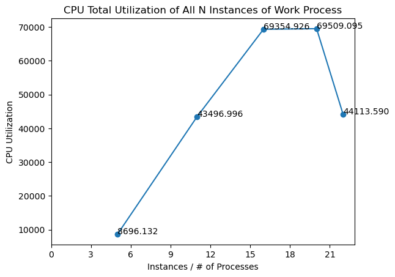
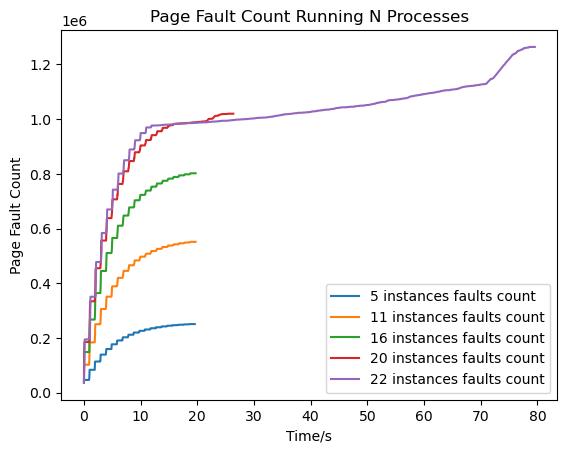

[](https://classroom.github.com/a/V8dS5v7Z)
# MP3-PageFaultProfiler

## Overview
This Linux kernel module, part of the CS-423 MP3 project, is designed for monitoring various process metrics such as CPU utilization and page faults. It allows for dynamic registration and deregistration of processes to be monitored, and utilizes kernel mechanisms like workqueues, spinlocks, and memory mapping for efficient data handling and user-space communication.

## Functionalities

### Process Registration and Deregistration
- **Registering Processes**: Processes are registered via writing to the `/proc/mp3/status` file. The module keeps track of each registered process in a linked list, storing individual process metrics.
- **Deregistering Processes**: Processes can be deregistered in a similar manner. The module removes the process from the monitoring list and frees associated resources.

### Monitoring Mechanism
- The module periodically fetches and updates CPU utilization and page fault counts of the registered processes using a delayed work queue.
- These metrics are accumulated and stored in a vmalloc'ed buffer, which is made accessible to user-space via memory mapping.

### Character Device Interface
- A character device is created to facilitate memory-mapped I/O, allowing user-space programs to access the monitoring data directly.
- The device supports basic operations like open, close, and mmap.

### Synchronization
- Spinlocks are used to ensure data consistency and thread-safe operations on shared data structures.


## Building and Loading
- The module can be built using the provided Makefile.
- Load the module with `insmod mp3.ko` and unload it with `rmmod mp3`.

## Usage
- Write 'R PID' to `/proc/mp3/status` to register a process with the given PID.
- Write 'U PID' to the same file to deregister a process.
- Access the monitoring data via the created character device.

## Example

### Step 1: Create a Character Device
First, create a character device with the major number 423 and minor number 0.
```
root@q:~/cs423/mp3-Zhenhao-Zhao# mknod node c 423 0
```

### Step 2: Start Work Processes
Next, start two instances of the `work` program with different configurations using the `nice` command. This command will run the `work` processes with different niceness values, affecting their scheduling priority.
```
root@q:~/cs423/mp3-Zhenhao-Zhao# nice ./work 1024 R 50000 & nice ./work 1024 L &
```

### Step 3: Observe Work Process Iterations
You can observe the work processes performing their iterations. Each process will output its current iteration number.
```
[1] 536
[2] 537
...
[536] 19 iteration
[537] 19 iteration
```

### Step 4: Collect Profiling Data
Finally, use the `monitor` program to collect profiling data from the kernel module. The data is redirected to `profile2.data` file for analysis.
```
root@q:~/cs423/mp3-Zhenhao-Zhao# ./monitor > profile2.data
```

# Anylysis

## Case Study 1

From the two graphs, it's apparent that there are no major page faults in either case. Regarding
minor page faults, the first case, which involves two random access processes, exhibits more
minor page faults than the second one, which involves one random and one locality-based
access. This indicates that random access patterns result in more page faults because the page
fault replacement policy is less effective at reducing page faults when the access pattern is
random.

The completion time is essentially the same for both cases, around 20 seconds, because there
are no major page faults to necessitate disk I/O.


## Case Study 2

From these two graphs, it can be seen that before n is less than or equal to 16, the CPU
utilization grows almost linearly. During this phase, there are only minor page faults and no
major page faults. The completion time is consistent at around 20 seconds. However,
afterwards, when n increases to 20 and 22, the CPU utilization does not continue to increase
linearly but instead decreases, indicating that thrashing occurs. Major page faults appear at this
point, and the CPU is idle as the page fault handler is caught in a continuous cycle of replacing
pages. The completion time is no longer 20 seconds but has increased.




