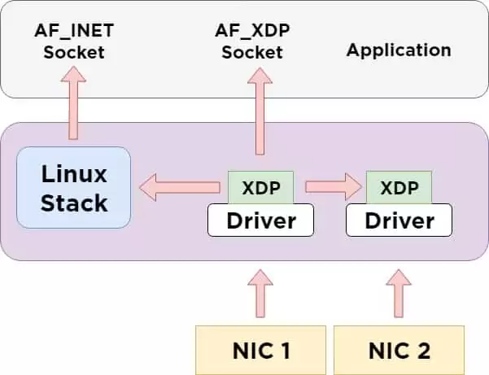

# MP4: Rust-based inner-unikernels

**Note: You need to be on the x86-64 architecture in order to work on this
MP. We assume the x86-64 architecture and ABI in this writeup.**
**Note2: If you are using aarch64 architecture, you will need to find another x86-64 computer or run this project in emulation**

**Please make sure you read through this document at least once before starting.**

# Table of Contents

- [MP4: Rust-based inner-unikernels](#mp4-rust-based-inner-unikernels)
- [Table of Contents](#table-of-contents)
- [Introduction](#introduction)
- [Problem Description](#problem-description)
  - [eBPF XDP Program](#ebpf-xdp-program)
- [Implementation Overview](#implementation-overview)
  - [Docker setup](#docker-setup)
    - [Host Requirements](#host-requirements)
    - [Repo setup](#repo-setup)
    - [Build Linux kernel and libbpf](#build-linux-kernel-and-libbpf)
    - [Run Sample Hello](#run-sample-hello)
  - [Understand the inner-unikernel repo structure](#understand-the-inner-unikernel-repo-structure)
    - [Try out the ebpf xdp sample.](#try-out-the-ebpf-xdp-sample)
    - [Try out the inner-unikernel xdp sample.](#try-out-the-inner-unikernel-xdp-sample)
  - [Make the ebpf version program](#make-the-ebpf-version-program)
  - [Make the inner-unikernel version program](#make-the-inner-unikernel-version-program)
- [Other Requirements](#other-requirements)
- [Resources](#resources)

# Introduction

The emergence of verified eBPF bytecode is ushering in a new era of safe kernel extensions. In this paper, we argue that eBPF’s verifier—the source of its safety guarantees—has become a liability. In addition to the well-known bugs and vulnerabilities stemming from the complexity and ad hoc nature of the in-kernel verifier, we highlight a concerning trend in which escape hatches to unsafe kernel functions (in the form of helper functions) are being introduced to bypass verifier-imposed limitations on expressiveness, unfortunately also bypassing its safety guarantees. We propose safe kernel extension frameworks using a balance of not just static but also lightweight runtime techniques. We describe a design centered around kernel extensions in safe Rust that will eliminate the need of the in-kernel verifier, improve expressiveness, allow for reduced escape hatches, and ultimately improve the safety of kernel extensions.

The basic ideas are documented in [a workshop paper](docs/rust-kernel-ext.pdf) (no need to read through).

# Problem Description

Your task is to implement an inner-unikernel program in Rust, equivalent to an eBPF version. This is conceptually straightforward. However, the real challenge lies in mastering inner-unikernel operations and integrating them with your knowledge of Linux kernel programming, Rust programming, and other essential aspects like ELF (Executable and Linkable Format). This task will test your technical skills and ability to quickly adapt to new programming environments.

To implement a packet filtering mechanism using both eBPF and an inner-unikernel program, your objective is to drop incoming network traffic based on predefined rules for port numbers and protocol types (TCP or UDP). The steps you need to follow are:

1. Write an eBPF program that employs the XDP hook to inspect and potentially drop packets at an early stage in the networking stack.
2. Create a user-space application that interacts with the eBPF program, particularly focusing on updating the rules for packet filtering (such as which ports to block).
3. Develop an inner-unikernel program that similarly inspects traffic and creates a user-space application for updating the rules for packet filtering.



## eBPF XDP Program

The eBPF program will be attached to the XDP hook in the Linux kernel. XDP provides high-performance packet processing at the earliest point where a packet is received by the network driver.

The eBPF XDP program will:

1. Inspect each incoming packet's header to determine the port number and protocol (TCP/UDP).
2. Check against a set of rules defined in a BPF map (a key-value store used by eBPF programs for storing runtime data).
3. Decide whether to drop the packet or allow it to pass based on these rules.

# Implementation Overview

We recommend approaching this MP in the following steps:

## Docker setup

In this setup, we will have `mp4` docker image as the all-in-one environment for compiling and running the samples.

### Host Requirements

- Docker

### Repo setup

If you are using macOS, you need to create a case sensitive volume for the repo. Please follow the instructions in this article:
[link](https://brianboyko.medium.com/a-case-sensitive-src-folder-for-mac-programmers-176cc82a3830)

Clone mp4 repo and its submodules:

```bash
git clone MP4_REPO_URL
cd MP4_REPO
git submodule update --recursive --init --progress --depth=1

# get the docker image
docker pull ghcr.io/chinrw/mp4:latest
docker tag ghcr.io/chinrw/mp4:latest mp4
```

### Build Linux kernel and libbpf

If you are using Apple Silicon, you need to set the environment variable by
`export DOCKER_DEFAULT_PLATFORM=linux/amd64` before running the `make` command.

```bash
# On host
cp ./q-script/.config ./linux/.config
# build kernel
make vmlinux
# build bpf
make libbpf
# build libiu
make iu
```

### Run Sample Hello

```bash
# build sample hello
make iu-examples
# start qemu
make qemu-run
# start ssh session with qemu
make qemu-ssh
# alternatively, use standard ssh to connect to vm
ssh -o "UserKnownHostsFile=/dev/null" -o "StrictHostKeyChecking=no" -t root@127.0.0.1 -p 52222
cd /inner_unikernels
export LD_LIBRARY_PATH=`realpath ./libiu`:`realpath linux/tools/lib/bpf`:$LD_LIBRARY_PATH
# run sample hello
cd samples/hello
./loader &
./event-trigger
```

and you should see some similar output as the following:

```console
<...>-245     [002] d...1    18.417331: bpf_trace_printk: Rust triggered from PID 245.
```

We recommend you to take a look at both the hello program and the loader
file to get familiar with the task you are going to work on.

## Understand the inner-unikernel repo structure

The repository contains the following directories:

- `libiu`: This is the equivalent of `libbpf` for inner-unikernel programs. You should not modify any files in this directory.
- `inner_unikernel_rt`: This is the runtime crate for inner-unikernel programs and contains the program type and helper function definitions.
  - You will need to add helper functions to `src/xdp/xdp_impl.rs` but should avoid changing any other files.
- `ebpf_xdp_blocker`: This directory contains the eBPF program that you need to implement.
- `samples/hello`: This directory contains the `hello` example that we have just seen.
- `samples/mp4-sample`: This is the directory of the program you need to implement.
  - Specifically, you should place the inner-unikernel program code in `src/main.rs` and the loader code in `entry.c`.

### Try out the ebpf xdp sample.

You can build it with the following command:

```bash
# assume you are in the root of the MP4 repo
make ebpf-xdp-blocker
```

Then, use qemu script to start the VM, please check the [Docker setup](#docker-setup) section for more details.

```bash
# assume you are in the root of the MP4 repo
cd /inner_unikernels
export LD_LIBRARY_PATH=`realpath ./libiu`:`realpath linux/tools/lib/bpf`:$LD_LIBRARY_PATH
cd ebpf_xdp_blocker
# you could use command `ip a` to find the interface index for lo
# which should be 1
./blocker 1
```

### Try out the inner-unikernel xdp sample.

```bash
# assume you are in the root of the MP4 repo
make mp4-sample
# start qemu
make qemu-run
# run sample xdp
cd ../inner_unikernels/samples/mp4-sample
# bind xdp program to interface lo
./entry 1
```

## Make the ebpf version program

We suggest you first create a working eBPF version of the XDP program based on the `ebpf_xdp_blocker` directory. You need to achieve the following:

1. Create an eBPF map to store filter rules. You can write some test code in `blocker_user.c` to add rules to the map. You can use `bpftool map` to check the map content.
   1. We have created a map for you in `blocker_kern.c`; feel free to change it if you wish.
2. Update the `xdp_filter_by_port` function in `blocker_kern.c` to filter incoming packets based on the eBPF map.
3. Update the `blocker_user.c` file to include additional parameter processing for adding rules, in addition to the existing binding interface part. Implement the new action `./blocker add_rule <port> <protocol>` to add rules to the eBPF map. Adding rules for removal is optional.

A hint for implementation: you can use `bpf_map_lookup_elem` to retrieve values from the map and `bpf_map_update_elem` to update the map.

Note: Ensure you check the functionality of the eBPF program before proceeding to the next step.

## Make the inner-unikernel version program

1. We have provided you with the `mp4-sample` directory for the inner-unikernel version of the XDP program. You can start by implementing the `ip_header` function in the `inner_unikernel_rt/src/xdp/xdp_impl.rs` file. This function is used to parse the IP header from a packet. You can try this by uncommenting `let ip_header = obj.ip_header(ctx);` in `mp4-sample/src/main.rs` and check if it works inside Docker.
2. Continue implementing the `udp_header` and `ucp_header` functions inside `xdp_impl.rs`. Then, uncomment the corresponding code in `main.rs` to test it.
3. Update the `entry.c` file based on the eBPF `blocker_user.c` file.
   a. One hint for implementing the loader is that `iu_object__open` should be used instead of `bpf_object__open` for inner-unikernel programs. Moreover, `bpf_object__load` is not needed because `iu_object__open` already takes care of loading.
   b. As we did for the eBPF version program, you need to add additional parameter processing for adding rules, besides the existing binding interface part. Implement the new action `./entry add_rule <port> <protocol>` to add rules to the eBPF map. Adding rules for removal is optional.
4. Update the `main.rs` file based on the eBPF `blocker_kern.c` file.
   a. You can refer to the `samples/map_test` folder to see how to use the map in Rust.

# Other Requirements

- Do not change any other files except the files mentioned above.
- Your Rust code should not have any `unsafe` block in the inner-unikernel
  program, but can have `unsafe` blocks in the `inner_unikernel_rt` crate.
- You should not use any other extern crates (i.e. Rust packages) other
  than the provided `inner_unikernel_rt` and the basic `rlibc`.
- You cannot use the Rust `std` library because it is not available in
  standalong mode, but the `core` library remains largely available.
- This research is currently not available to the public. So please do not put the inner-unikernel code on GPT.

# Resources

We recommend you to get your hands dirty directly and check these resources
on demand. In fact, we didn’t know Rust well when we started this project –
you can always learn a language by writing the code.

- eBPF: [ebpf.io](https://ebpf.io/) and
  [The Illustrated Children’s Guide to eBPF](https://ebpf.io/books/buzzing-across-space-illustrated-childrens-guide-to-ebpf.pdf) and [xdp-tutorial](https://github.com/xdp-project/xdp-tutorial) both are good places
  to start. You can also find the official kernel documentation
  [here](https://elixir.bootlin.com/linux/v5.15.127/source/Documentation/bpf)
  along with the source code. In particular, try answering:
  - What is eBPF?
  - What is XDP?
  - What are some example use cases of eBPF?
  - How are eBPF programs loaded to the kernel and bind XDP program to interfaces?
  - How are the execution of eBPF programs triggered?
  - What are eBPF helpers?
- Rust: If you are not familiar with the Rust program language, we have some resources for you:
  - [The Rust book](https://doc.rust-lang.org/book/) (Probably the most comprehensive guide on Rust programming)
  - [Library API reference](https://doc.rust-lang.org/std/index.html) (for searching API specifications)
  - [The Rust playground](https://play.rust-lang.org) (for trying out programs)
